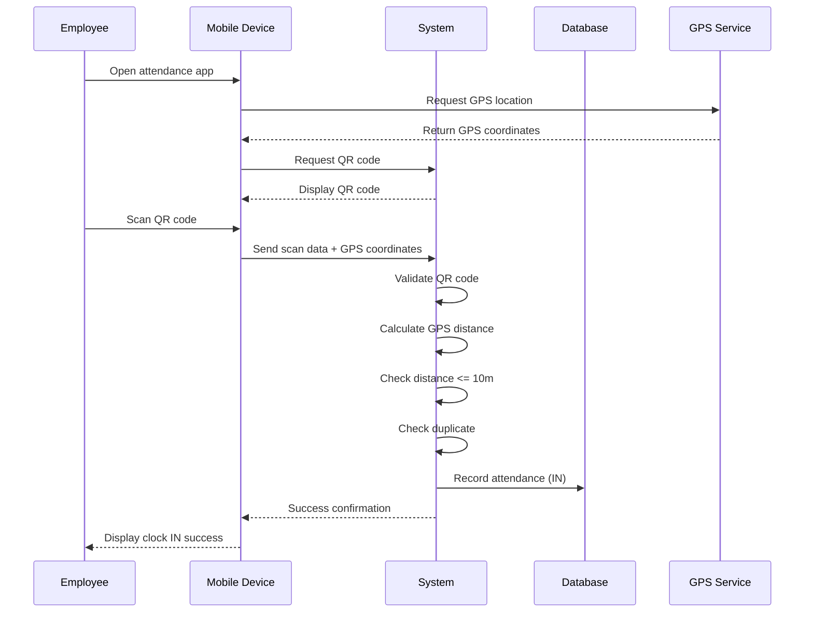
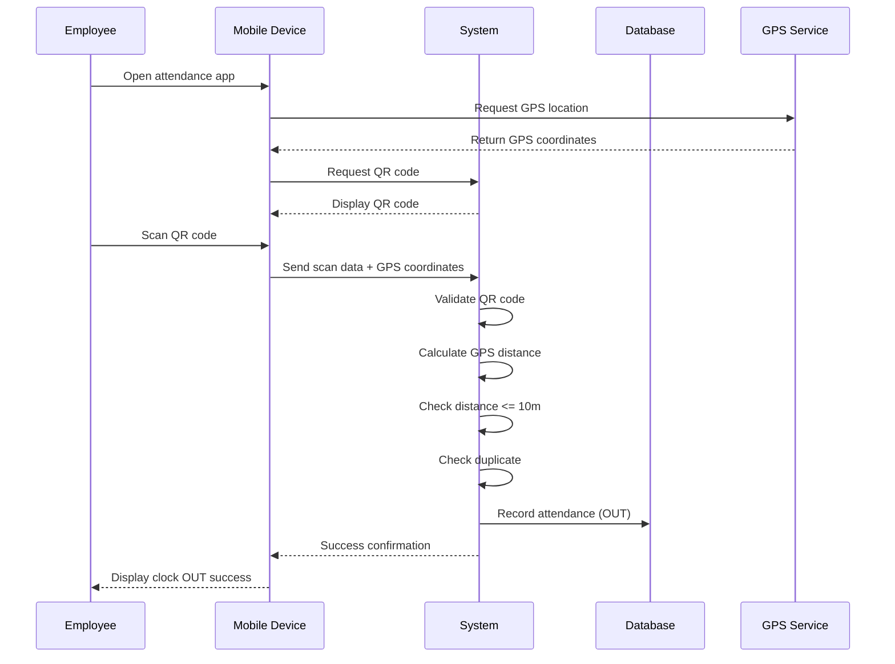
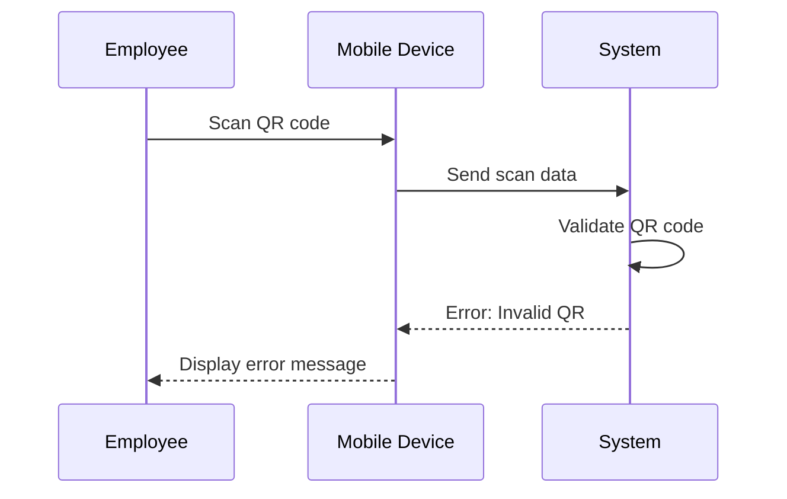
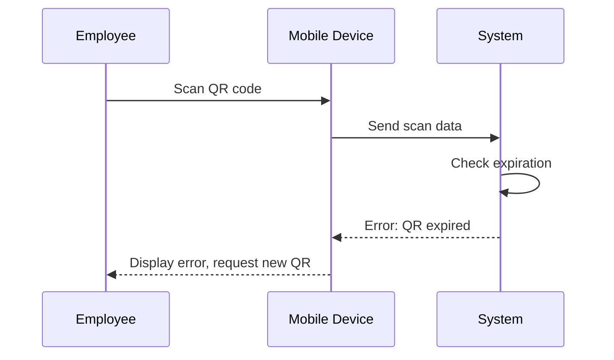
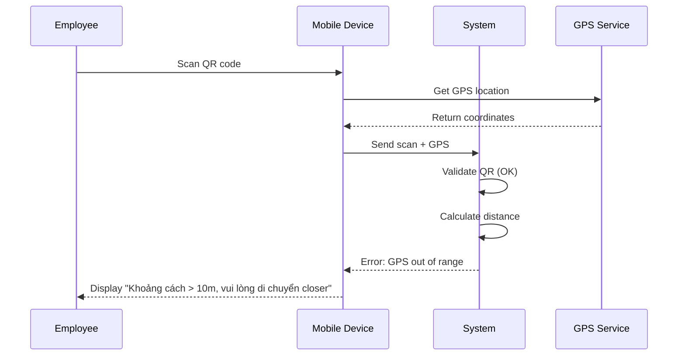
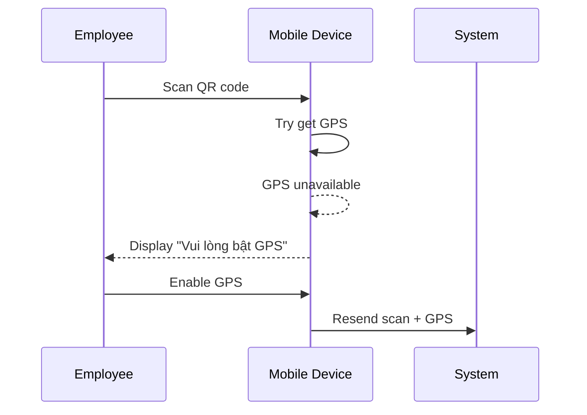
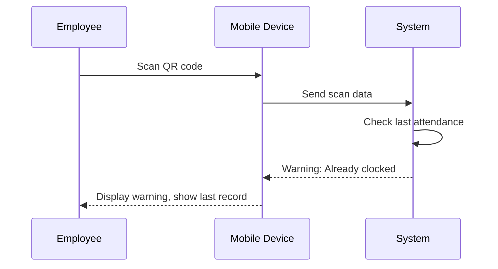
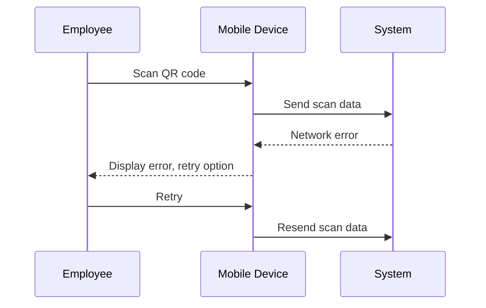

# MOD-01: QR Attendance - Workflow

## Main Workflow: Clock IN (with GPS Verification)

## Main Workflow: Clock OUT (with GPS Verification)

## Alternative Flows

### AF-01: Invalid QR Code

### AF-02: Expired QR Code

### AF-03: GPS Out of Range (NEW)

### AF-04: GPS Unavailable (NEW)

### AF-05: Duplicate Scan

### AF-06: Network Error

## Business Rules in Workflow

| Rule | Trigger Point | Action |
|------|---------------|--------|
| BR-01: QR Validity | Validate QR code | Reject if invalid/expired |
| BR-03: Duplicate Prevention | Before recording | Check last attendance status |
| BR-08: GPS Verification (NEW) | After QR validation | Calculate distance, reject if > 10m |
| BR-10: Success Condition (NEW) | Final validation | Both QR AND GPS must pass |

## Error Handling

| Error Type | User Message | System Action |
|------------|--------------|---------------|
| Invalid QR | "Mã QR không hợp lệ" | Log attempt |
| Expired QR | "Mã QR đã hết hạn" | Log attempt |
| GPS Out of Range | "Khoảng cách > 10m, vui lòng di chuyển closer" | Log attempt |
| GPS Unavailable | "Vui lòng bật GPS trên thiết bị" | Prompt to enable |
| Duplicate | "Bạn đã chấm công rồi" | Show last record |
| Network Error | "Lỗi kết nối, vui lòng thử lại" | Queue for retry |

## Status Codes

| Code | Meaning |
|------|---------|
| SUCCESS_IN | Clock IN successful |
| SUCCESS_OUT | Clock OUT successful |
| ERROR_INVALID_QR | QR code invalid |
| ERROR_EXPIRED_QR | QR code expired |
| ERROR_GPS_OUT_OF_RANGE | GPS distance > 10m (NEW) |
| ERROR_GPS_UNAVAILABLE | GPS not available (NEW) |
| WARNING_DUPLICATE | Duplicate scan detected |
| ERROR_NETWORK | Network error |

## Open Questions

| ID | Question |
|----|----------|
| OQ-M01-W01 | What is the QR code validity period? |
| OQ-M01-W02 | Is QR code single-use or multi-use? |
| OQ-M01-W03 | What is minimum interval between scans? |
| OQ-M01-W04 | How to handle offline attendance? |
| OQ-M01-W05 | Is manual override possible? |
| OQ-M01-W06 | What happens when GPS is unavailable? (NEW) |
| OQ-M01-W07 | Is GPS accuracy threshold configurable? (NEW) |
| OQ-M01-W08 | Can attendance be recorded if GPS fails but QR is valid? (NEW) |
