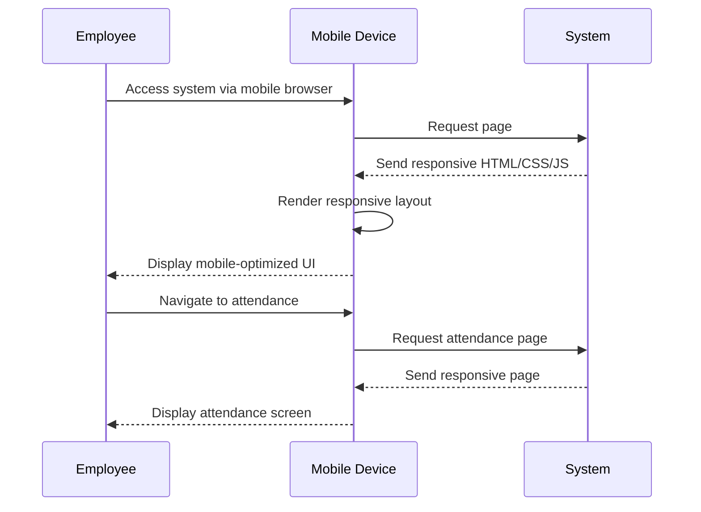

# MOD-02: Mobile Responsive - Workflow

## Main Workflow

## Responsive Breakpoints (Inferred)

| Breakpoint | Device | Layout |
|------------|--------|--------|
| < 768px | Mobile | Single column |
| 768-1024px | Tablet | Two columns |
| > 1024px | Desktop | Full layout |

## Mobile-Specific Features

| Feature | Status | Notes |
|---------|--------|-------|
| Touch-friendly buttons | NOT SPECIFIED | Min 44px touch target |
| Swipe gestures | NOT SPECIFIED | TBD |
| Camera access | REQUIRED | For QR scanning |
| Orientation support | NOT SPECIFIED | Portrait/Landscape |

## Open Questions

| ID | Question |
|----|----------|
| OQ-M02-W01 | What are exact breakpoints? |
| OQ-M02-W02 | Is horizontal scrolling allowed? |
| OQ-M02-W03 | Are mobile gestures required? |
| OQ-M02-W04 | Is offline mode required? |
