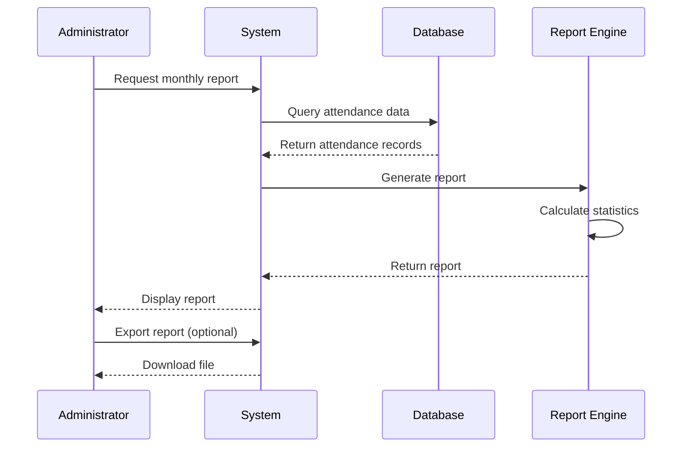
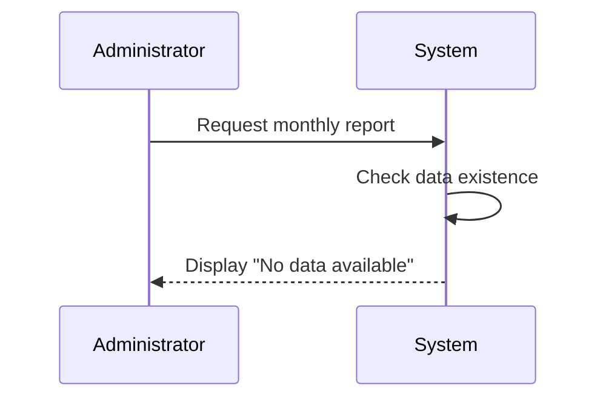
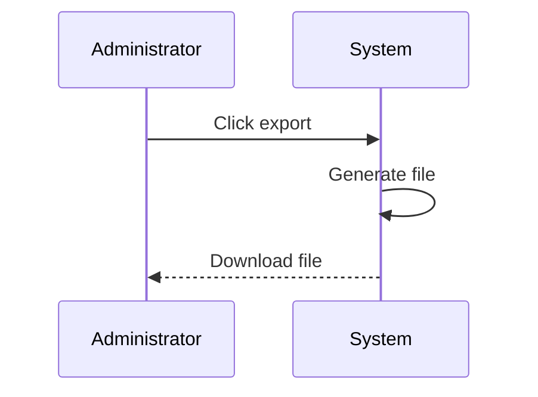

# MOD-03: Reports - Workflow

## Main Workflow: Generate Monthly Report

## Alternative Flows

### AF-01: No Data Available

### AF-02: Export Report

## Open Questions

| ID | Question |
|----|----------|
| OQ-M03-W01 | What export formats are supported? |
| OQ-M03-W02 | Can reports be scheduled? |
| OQ-M03-W03 | Is there report caching? |
| OQ-M03-W04 | Can reports be emailed? |
