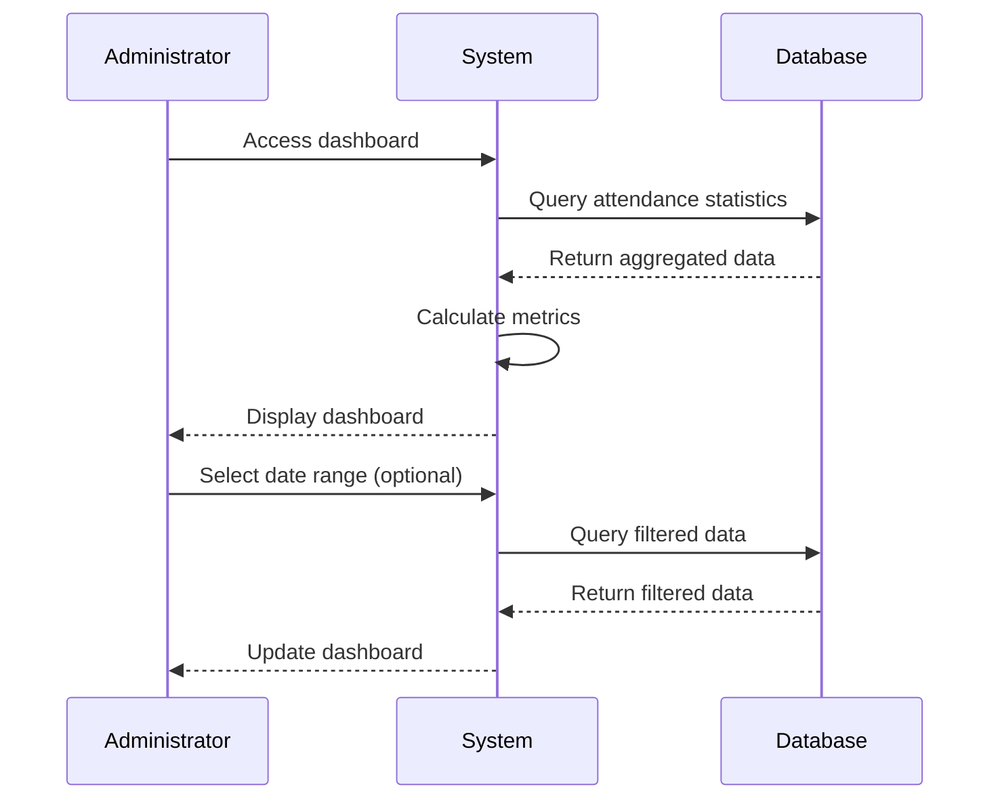

# MOD-04: Dashboard - Workflow

## Main Workflow

## Dashboard Widgets (Inferred)

| Widget | Description | Status |
|--------|-------------|--------|
| Today's Attendance | Present/Absent count | INFERRED |
| Late Arrivals | Late count today | INFERRED |
| Monthly Trend | Attendance over time | NOT SPECIFIED |
| Department Stats | Per-department stats | NOT SPECIFIED |

## Open Questions

| ID | Question |
|----|----------|
| OQ-M04-W01 | What specific widgets are required? |
| OQ-M04-W02 | Is real-time updates required? |
| OQ-M04-W03 | Can dashboard be customized? |
| OQ-M04-W04 | What chart types are needed? |
