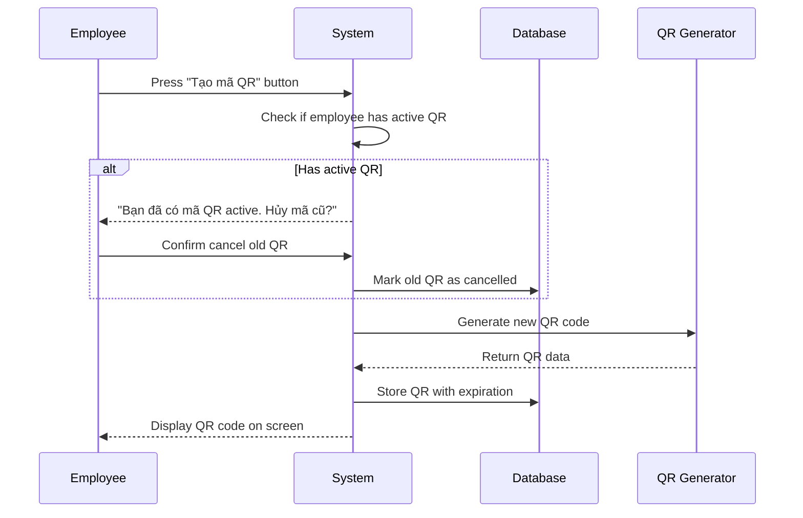
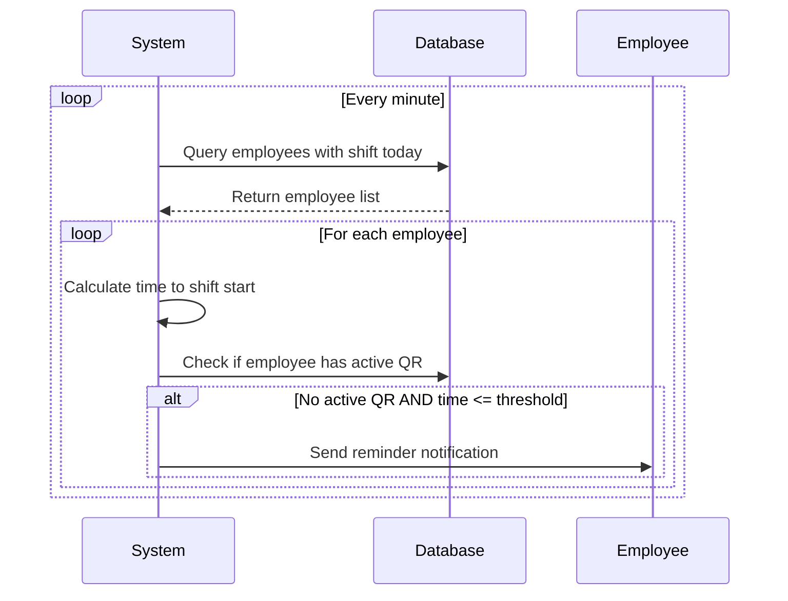
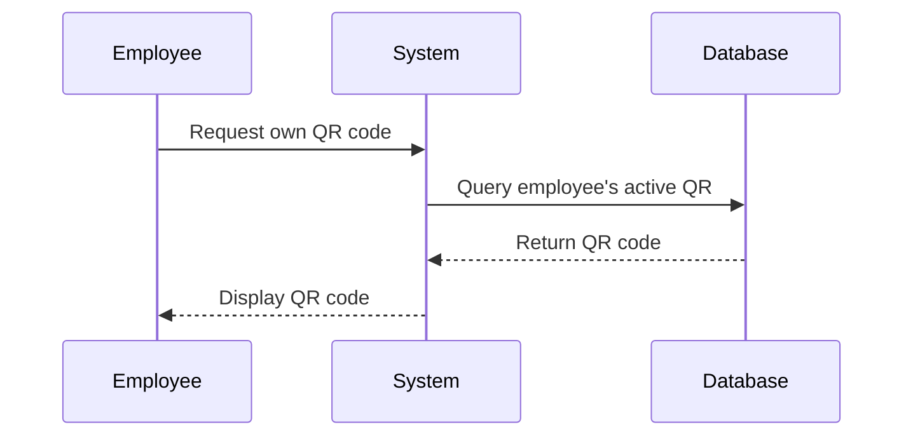
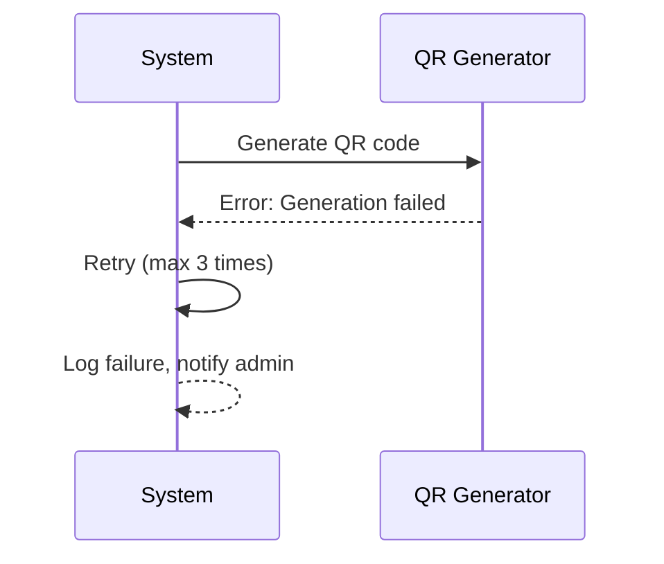
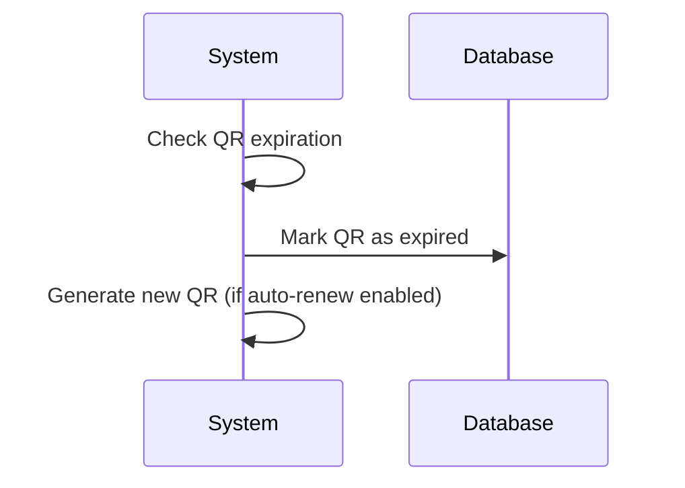
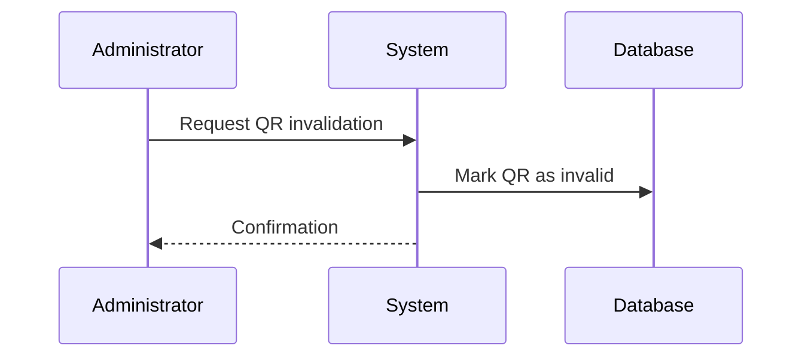

# MOD-05: QR Code Generation - Workflow

## Main Workflow: Employee Generates QR Code

## Main Workflow: Work Time Reminder

## Main Workflow: Employee Views QR Code

## Alternative Flows

### AF-01: QR Generation Failure

### AF-02: QR Code Expired

### AF-03: QR Code Invalidated

## Business Rules in Workflow

| Rule | Trigger Point | Action |
|------|---------------|--------|
| BR-09: QR Generation | Generate QR | Create unique code with expiration |
| BR-01: QR Validity | Validate QR | Check expiration and status |

## Error Handling

| Error Type | User Message | System Action |
|------------|--------------|---------------|
| Generation Failed | "Lỗi tạo mã QR" | Retry, log, notify admin |
| QR Expired | "Mã QR đã hết hạn" | Mark expired, generate new |
| QR Invalidated | "Mã QR đã bị vô hiệu hóa" | Log attempt |

## Status Codes

| Code | Meaning |
|------|---------|
| QR_ACTIVE | QR code is active and usable |
| QR_EXPIRED | QR code has expired |
| QR_INVALIDATED | QR code manually invalidated |
| QR_GENERATION_FAILED | Failed to generate QR code |

## Open Questions

| ID | Question |
|----|----------|
| OQ-M05-W01 | What triggers automatic QR generation? |
| OQ-M05-W02 | Can QR codes be regenerated manually? |
| OQ-M05-W03 | Is there QR code history? |
| OQ-M05-W04 | Can QR codes be bulk generated? |
