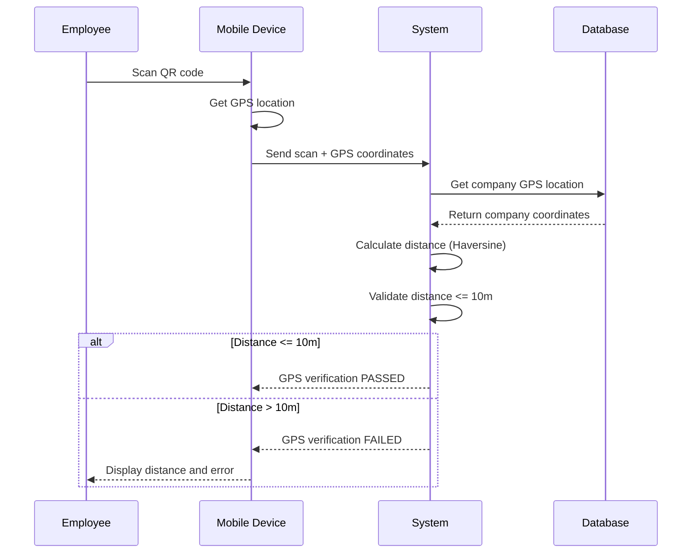
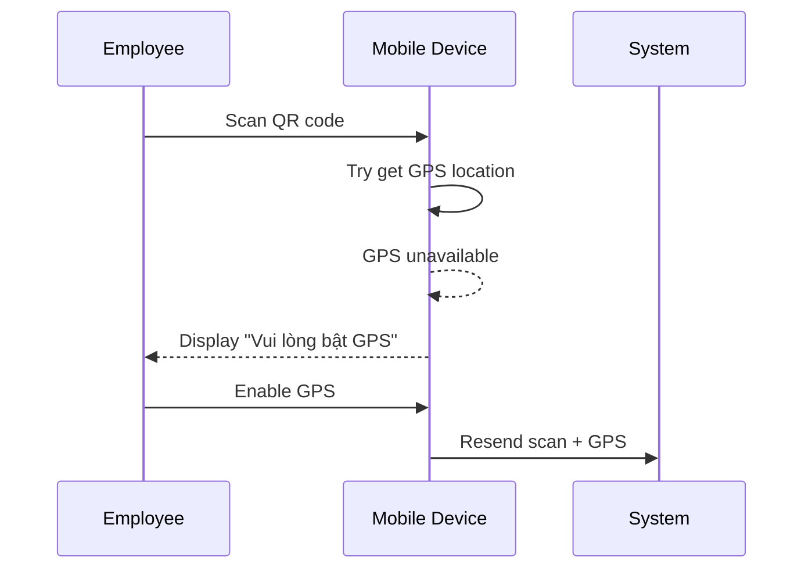
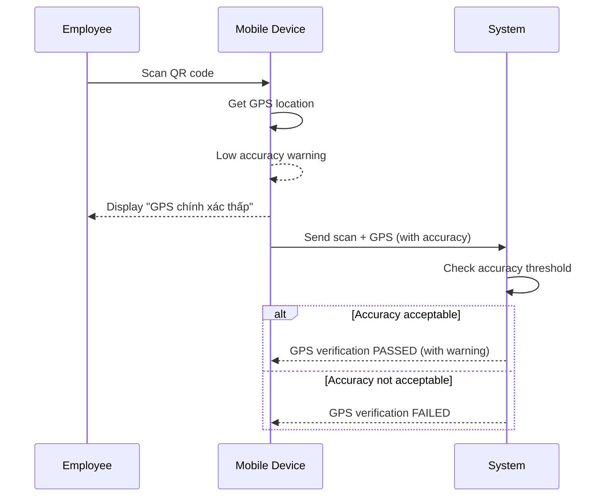
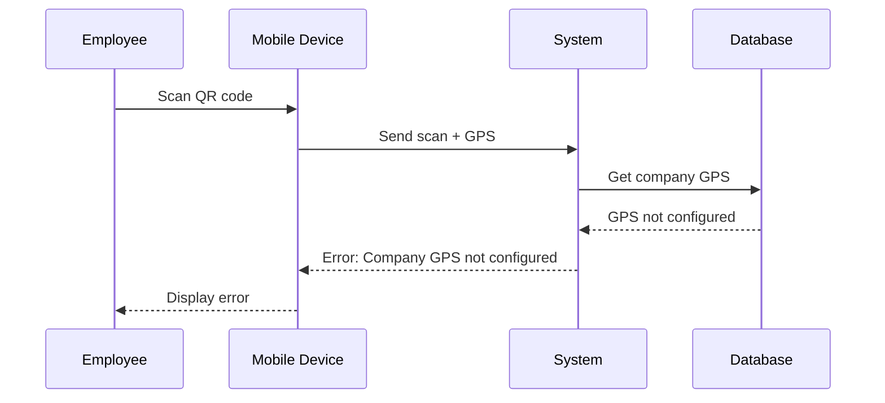

# MOD-06: GPS Location Verification - Workflow

## Main Workflow: GPS Verification

## Alternative Flows

### AF-01: GPS Unavailable

### AF-02: GPS Accuracy Low

### AF-03: Company GPS Not Configured

## Business Rules in Workflow

| Rule | Trigger Point | Action |
|------|---------------|--------|
| BR-08: GPS Verification | After QR validation | Calculate distance, validate ≤ 10m |
| BR-10: Success Condition | Final validation | Both QR AND GPS must pass |

## Error Handling

| Error Type | User Message | System Action |
|------------|--------------|---------------|
| GPS Unavailable | "Vui lòng bật GPS trên thiết bị" | Prompt to enable |
| GPS Out of Range | "Khoảng cách {distance}m > 10m" | Show distance, reject |
| GPS Inaccurate | "GPS chính xác thấp" | Warn user |
| Company GPS Missing | "Chưa cấu hình vị trí công ty" | Notify admin |

## Status Codes

| Code | Meaning |
|------|---------|
| GPS_VALID | Distance ≤ 10m |
| GPS_INVALID | Distance > 10m |
| GPS_UNAVAILABLE | GPS not available |
| GPS_INACCURATE | GPS accuracy low |
| COMPANY_GPS_MISSING | Company GPS not configured |

## Open Questions

| ID | Question |
|----|----------|
| OQ-M06-W01 | What is GPS accuracy threshold? |
| OQ-M06-W02 | Can manual override bypass GPS? |
| OQ-M06-W03 | How to handle multi-location? |
| OQ-M06-W04 | Is GPS caching allowed? |
