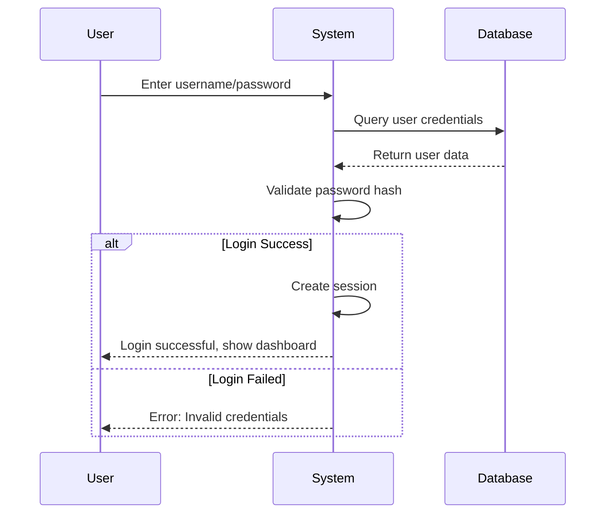
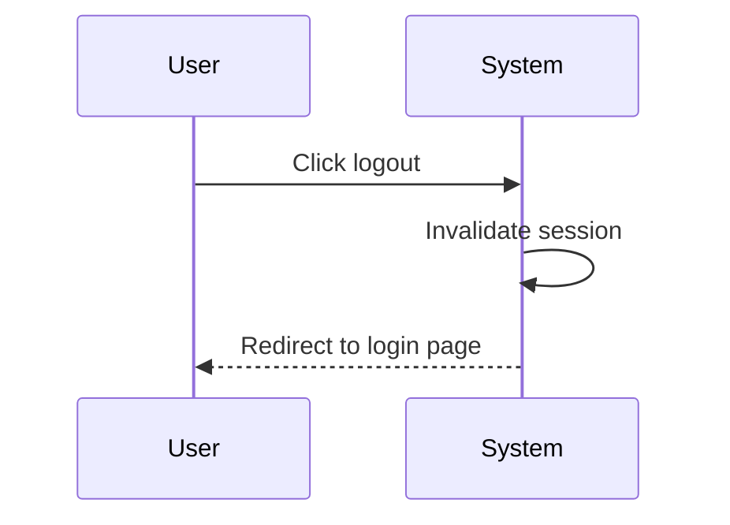
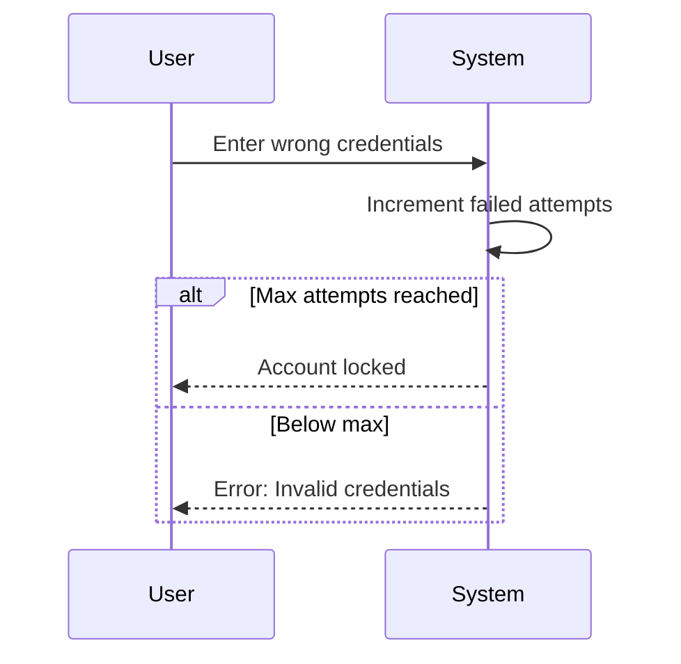
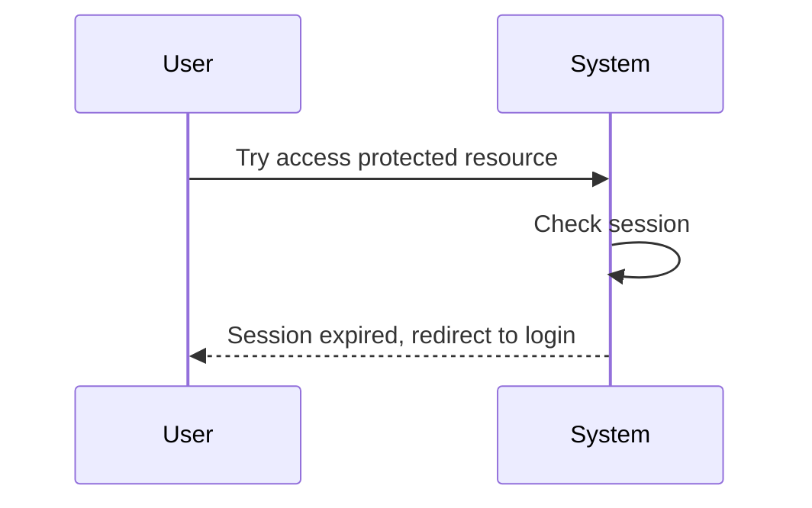

# MOD-07: Authentication - Workflow

## Main Workflow: User Login

## Main Workflow: User Logout

## Alternative Flows

### AF-01: Invalid Credentials

### AF-02: Session Expired

## Business Rules in Workflow

| Rule | Trigger Point | Action |
|------|---------------|--------|
| BR-11: Authentication | Login | Validate credentials |
| Session Management | After login | Create/invalidate session |

## Error Handling

| Error Type | User Message | System Action |
|------------|--------------|---------------|
| Invalid Credentials | "Tên đăng nhập hoặc mật khẩu không đúng" | Log attempt |
| Account Locked | "Tài khoản đã bị khóa" | Notify admin |
| Session Expired | "Phiên đã hết hạn, vui lòng đăng nhập lại" | Clear session |

## Status Codes

| Code | Meaning |
|------|---------|
| LOGIN_SUCCESS | Login successful |
| LOGIN_FAILED | Invalid credentials |
| ACCOUNT_LOCKED | Account locked |
| SESSION_EXPIRED | Session expired |
| LOGOUT_SUCCESS | Logout successful |

## Open Questions

| ID | Question |
|----|----------|
| OQ-M07-W01 | What is session timeout? |
| OQ-M07-W02 | Is remember me feature required? |
| OQ-M07-W03 | Is password reset required? |
